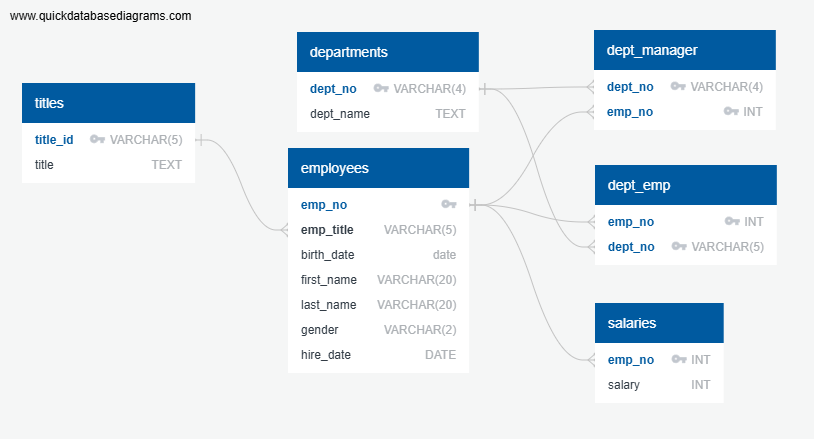

# Challenge 9 - SQL

## Data Modeling

## Data Engineering
The schemas for creating the six tables in the data base can be found in [`schema.sql`](EmployeeSQL/schema.sql).

- The Tables are named as follows departments,salaries,employees,dept_manager,dept_emp,titles.
-  `dept_no` and `title_id`/`emp_title_id` ,'first_name', 'last_name'and `gender` are VARCHARs.
- All other strings are TEXT.
- Two of the tables(dept_manager,dept_emp) have composite primary keys since there is no single unique column

  

## Data Analysis
The queries to get answers to the data analysis lists are found in [`queries.sql`](EmployeeSQL/queries.sql)

Number of results for each query

1. 300,024
2. 36,150
3. 24
4. 331,603
5. 20
6. 52,245
7. 137,952
8. 1,638
